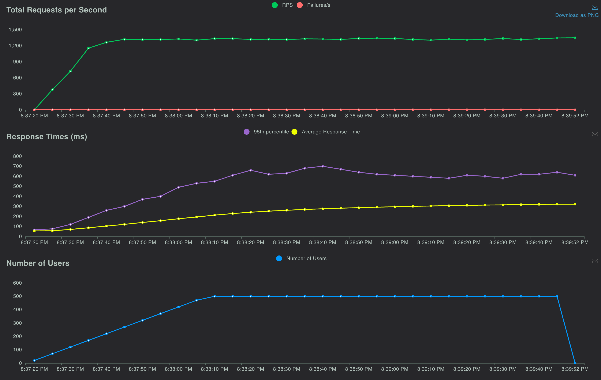
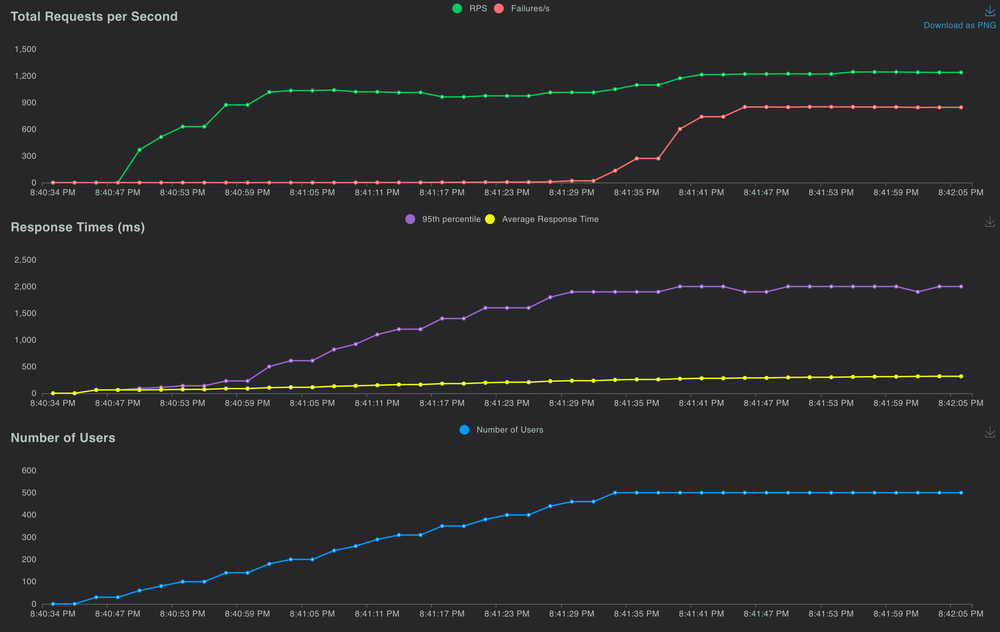

# Django Ninja Test

## Goals
I wanted to see how Django Ninja compared to a more established framework like Django Rest Framework (DRF), which I'm used to using. I know DRF has a lot of haters (even I was at one point), but I have grown to love it. I'm a simple person. That said, I wanted to check out the new kid on the block.

## What Interested Me About Ninja
Two things interested me:
1. Pydantic for serialization & validation of inputs
2. Async support with more native building around ASGI

## Pydantic Serialization & Validation
I'm not 100% Pydantic pilled tbh. It's very nice for coercing data returned from APIs, but it feels like a lot of boilerplate to get serialization working within limits. This is primarily what I found incredibly frustrating about Ninja.

Generating a schema from a Django model seems simple on the surface, but after further investigation, there is a lot lacking. Decimal fields with limits on number of digits and decimal places at the model level are not validated against those in the serialization process. So I could pass `1.1` or `10000` to a `DecimalField(max_digits=3, decimal_places=0)` without any validation errors and then the data was saved differently on the database. Similarly, `URLField` gets validated as a string when using `ModelSchema` from Ninja. I found that this Django field is just completely missing from Ninja's `TYPES` [source code](https://github.com/vitalik/django-ninja/blob/e7dc90e02d776d8e608a5e6c5419dd0e3ee81874/ninja/orm/fields.py#L45).

Overwriting some of the validation for certain fields, like adding a regex validator, felt cumbersome. Maybe I'm not super familiar with Pydantic and that's why it felt annoying.

Overall, the serialization/validation process felt lacking compared to DRF. I know that DRF serializers aren't the fastest thing out there, but they mesh really well with Django at the core and `ModelSerializer` works incredibly well.

## Async Support
I was really excited to see more native async support with Ninja. There's a lot of discussion in the python community on `async` python version green threads (greenlet). People smarter than me are on both sides of the argument, so instead, I decided to just gather emperical evidence (like a good engineer 🤓). In this test, I tried to emulate a real world application setup rather than what most benchmark tests do. You can see each setup below or in the Makefile.

### Async Setup
Gunicorn in front of 4 Uvicorn ASGI workers.

### Sync Setup
Gunicorn in front of 4 Gevent WSGI workers.

### Test Setup
Both endpoints do the same thing. They parse incoming `POST `data using the same `ModelSchema`, save the object to the sqlite3 database, sleep for 50ms, and then return the object. I used async and sync versions of the ORM and `sleep` respectively.

Locust was used to load test the system locally on my machine. 500 users, ramping at 10 users per second.

### Test Results
Overall, the sync workers performed better than the async workers, regardless of which order I performed the test. Requests per second was actually quite similar, however sync workers resulted fewer errors and better 95 percentile in response time. Overall, average response time was very similar between the two, which is expected.

I acknowledge that this is my first "benchmark" test, so it may not be the most representative, but I think the results are still very interesting. Overall, I've been pretty convinced that synchronous python with gevent workers is overall better from the developer experience with minimal reduction in performance. If you are chasing raw performance, python just isn't the langugage for you, go look at go.

#### Sync Results

#### Async Results

## Other Feedback for Ninja
Routing felt really annoying. Not being able to use class based views felt like I was writing a lot of extra code. URL paths being in routers was also really annoying because you have to go look through your routers in order to find the routes instead of just one file.

The documentation is not the worst out there but is very much geared towards Django experts, which I'm not. I would say I'm advanced but no expert, so it was hard to know exactly what was needed.

Avoiding the use of Django settings also felt really sporatic. Having to make a global `NinjaAPI` object that you then add routers, auth, etc to just felt very anti Django. Many other aspects of Ninja felt that way, which I know I'm not the first person to knock it on that.

Lack of community also is scary to use it for a serious project where there might be just a few developers. At a larger company, like what is touted in the docs as "production use cases", there's likely Django experts there that can assist with any issues.

## Things I liked
I do enjoy the auto documentation without needing to use `drf_spectacular` and other modules.

## Conclusion
I'm going to stick with Django Rest Framework, but am curious to see where Ninja goes.